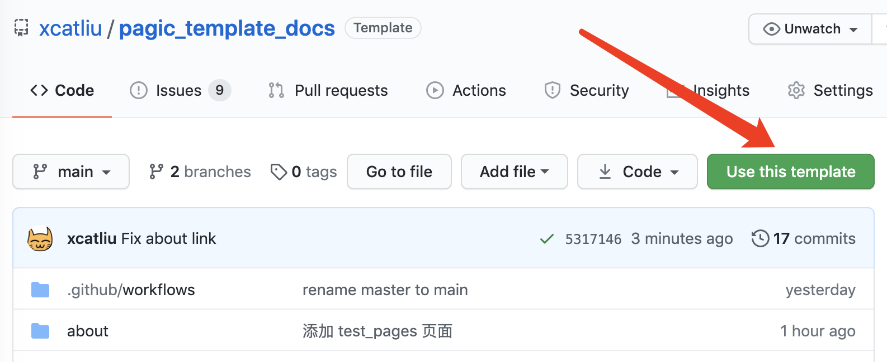
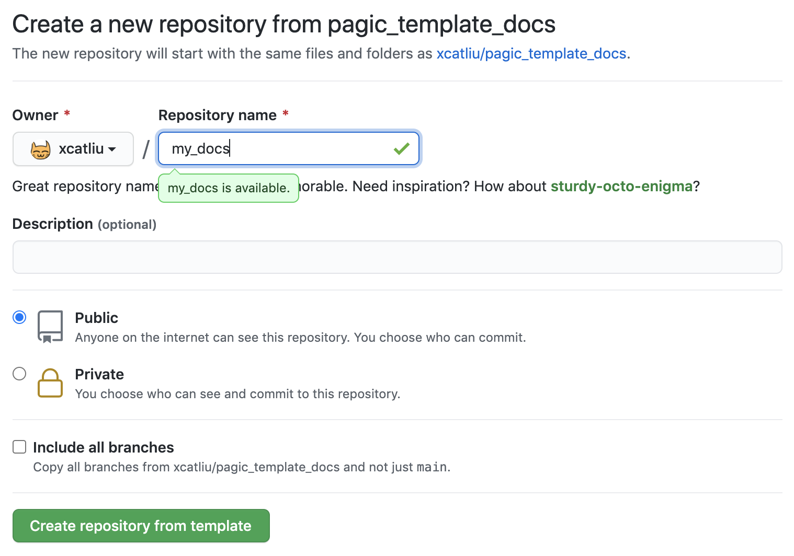
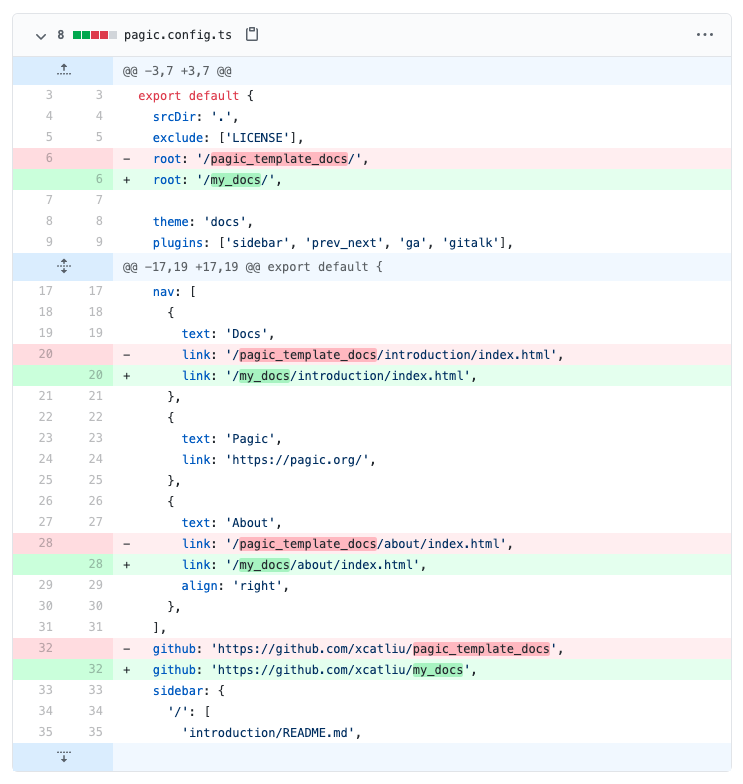

# Pagic template docs

Use this template to create a [Pagic](https://pagic.org) site with the *docs* theme.

## 1. Click the *Use this template* button in [this repo](https://github.com/xcatliu/pagic_template_docs)

## 2. Enter the *Repository name* and click the *Create repository from template* button

## 3. Edit `pagic.config.ts` file, replace `pagic_template_docs` by the *Repository name*

## 4. Go to *Settings* > *Options* > *GitHub Pages* and set Branch to gh-pages

